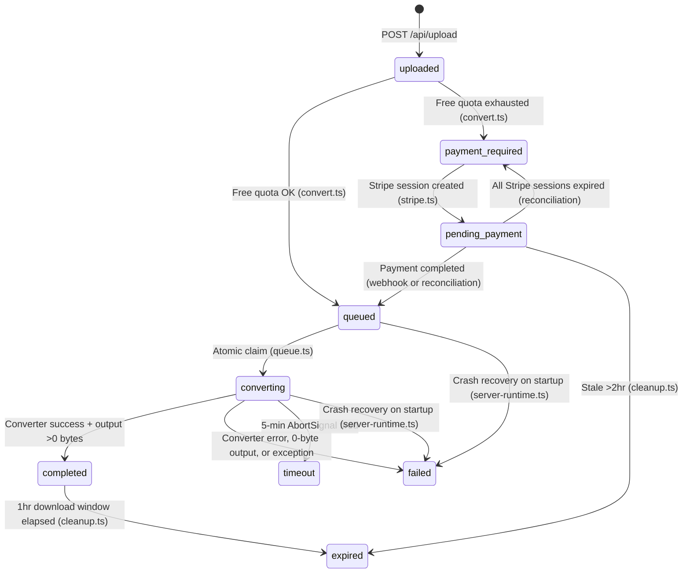

# CLAUDE.md

This file provides guidance to Claude Code (claude.ai/code) when working with code in this repository.

## Project

WittyFlip is an online document conversion service (DOCX→Markdown, DJVU→PDF, etc.) targeting organic search traffic. Freemium model: 2 free conversions/day per IP, then $0.49/file via Stripe. The full specification lives in `spec/SPEC.md`.

## Tech Stack

- **Framework:** TanStack Start (React, SSR, Vite-based)
- **Styling:** Tailwind CSS + shadcn/ui
- **Database:** SQLite + Drizzle ORM
- **Payments:** Stripe Checkout (guest mode, no accounts)
- **Conversion tools:** Pandoc, LibreOffice, djvulibre, Calibre, weasyprint, texlive
- **Logging:** Pino (JSON structured logging)
- **Monitoring:** Custom `/api/metrics` endpoint + `tools/alert-check` (.NET alerting tool)
- **Deployment:** Docker + Caddy reverse proxy on Hetzner VPS

## Commands

```bash
npm install              # Install dependencies
npm run dev              # Dev server with HMR
npm run build            # Production build
npm run type-check       # TypeScript checking
npm run lint             # Linting
npm run db:generate      # Generate Drizzle migration from schema
npm run db:migrate       # Run Drizzle migrations
docker compose up        # Run full stack (app + Caddy)
docker compose --env-file .env.production up --build -d  # Production deploy
```

## Architecture

### Conversion Pipeline

```
Upload (POST /api/upload) → Rate Limit Check (POST /api/convert) → [Payment if needed] → Queue → Convert → Download (1hr window) → Cleanup
```

- Upload is always free/fast; rate limiting happens at the convert step
- Failed conversions do not consume free quota; paid conversions bypass it entirely
- DB-backed queue with max 5 concurrent conversion jobs
- Files stored as `{uuid}.{ext}`, never using user-provided filenames
- Converted files expire 1 hour after completion; cron cleans up every 15 minutes

### Database Tables

Four tables in SQLite via Drizzle ORM (`app/lib/db/schema.ts`):

- **conversions** — job tracking with status lifecycle: `uploaded → payment_required/pending_payment → queued → converting → completed/failed/timeout/expired`
- **rate_limits** — IP + date tracking for daily free quota
- **payments** — Stripe session/payment records linked to conversions
- **conversion_events** — audit log for all conversion/payment state changes (auto-populated via SQLite triggers)

### Routing

- `/$conversionType` — dynamic SSR landing page per conversion (e.g., `/docx-to-markdown`)
- `/blog` — blog index with post cards
- `/blog/$slug` — blog posts for SEO long-tail keywords (4 posts in `content/blog/`)
- API routes under `app/server/api/`: upload, convert, conversion-status, download, create-checkout, webhook/stripe

### Converter Registry

Each conversion tool has a wrapper in `app/lib/converters/` (pandoc.ts, libreoffice.ts, etc.) registered through `app/lib/converters/index.ts`. Conversions run as child processes with 5-minute timeout and dropped Linux capabilities.

### Converter Wrappers

Six converters in `app/lib/converters/`, each using shared infrastructure:

- **Shared:** `spawn-helper.ts` (subprocess with AbortSignal), `converter-run.ts` (common convert logic), `sanitize-error.ts` (path redaction + ANSI stripping), `register-all.ts` (idempotent bootstrap)
- **pandoc.ts** — DOCX→MD, MD→PDF (via weasyprint engine), ODT→DOCX
- **djvulibre.ts** — DJVU→PDF via `ddjvu`
- **calibre.ts** — EPUB→MOBI via `ebook-convert`
- **weasyprint.ts** — HTML→PDF with `--base-url /dev/null` (runtime `--network=none` needed for full SSRF protection)
- **pdflatex.ts** — LaTeX→PDF with temp working dir, extracts `!`-prefixed error lines
- **libreoffice.ts** — ODT→DOCX fallback, unique temp profile per invocation

### API Routes

**Server functions** (TanStack `createServerFn` in `app/server/api/`):

- `upload.ts` — `POST /api/upload` (FormData): validate, save file, insert DB row
- `convert.ts` — `POST /api/convert` ({ fileId }): rate-limit check, atomic slot reservation, enqueue or return 402
- `conversion-status.ts` — `GET /api/conversion/{fileId}/status`: poll status, check artifact/expiry, reconcile pending payments
- `rate-limit-status.ts` — `GET /api/rate-limit-status`: remaining free conversions for IP
- `create-checkout.ts` — `POST /api/create-checkout` ({ fileId }): create/reuse Stripe session

**File-based route handlers** (`app/routes/api/`):

- `download/$fileId.tsx` — `GET /api/download/{fileId}`: stream file with Content-Disposition
- `webhook/stripe.tsx` — `POST /api/webhook/stripe`: verify signature, handle `checkout.session.completed`
- `health.tsx` — `GET /api/health`: returns `{ status: 'ok' }`
- `health/ready.tsx` — `GET /api/health/ready`: readiness probe (DB, storage checks) for orchestration
- `metrics.tsx` — `GET /api/metrics`: bearer-token-authenticated operational metrics (disk, queue, conversions, events)
- `sitemap[.]xml.tsx` — `GET /api/sitemap.xml`: auto-generated XML sitemap for SEO

**Shared:** `contracts.ts` (response types, status helpers, UUID validation), `status-utils.ts` (status payload builder)

### Request Throttling

`app/lib/request-rate-limit.ts` — in-memory bucket throttle: 10 req/min/IP for general endpoints, 20 req/min/IP for status polling. Separate from the daily free-conversion quota in `rate-limit.ts`.

### Observability & Operations

- **Structured logging** (`app/lib/logger.ts`): Pino-based JSON logging with request ID propagation (`app/lib/observability.ts`)
- **Readiness probe** (`/api/health/ready`): checks DB connectivity and storage write access
- **Metrics endpoint** (`/api/metrics`): bearer-token-gated, exposes disk usage, queue depth, conversion success rates, p50/p95 durations, per-tool aggregates
- **Event audit log** (`conversion_events` table): automatic SQLite triggers on conversion/payment state changes
- **Cleanup cron** (`app/lib/cleanup.ts`): runs every 15 minutes, expires completed files (1hr retention), cleans stale pending_payment (>2hr), scans orphan files
- **Crash recovery** (`app/lib/server-runtime.ts`): on startup, marks stale queued/converting jobs as failed and releases rate-limit slots
- **Alert checker** (`tools/alert-check/`): .NET console app that polls health/metrics and sends SMTP alerts on state changes (disk, queue backlog, stalled jobs, missing converters)

### Payment Reconciliation

`app/lib/stripe.ts` includes `reconcilePendingPayment()` which is called during status polling to handle missed webhooks — detects expired Stripe sessions (reverts to payment_required) and completed payments (re-queues the conversion).

### Implementation Status

- **Phase 1 (Foundation):** Complete — conversions registry, file validation, rate limiting, converter interface, queue, Stripe integration, ESLint, Drizzle migrations
- **Phase 2 (Converters):** Complete — all 6 converter wrappers with shared spawn/error infrastructure
- **Phase 3 (API Routes):** Complete — all API endpoints, request throttling, Stripe webhook, download streaming, health check
- **Phase 4 (UI):** Complete — shadcn/ui components, conversion pages, home page, file upload/download flow
- **Phase 5 (Observability):** Complete — structured logging, x-request-id propagation, metrics, readiness probe, cleanup cron, crash recovery, event audit log, payment reconciliation, alert checker
- **Phase 6 (Pages):** Complete — root layout with Header/Footer, homepage with conversion grid, dynamic `/$conversionType` SSR landing pages, 404 handling
- **Phase 7 (Blog):** Complete — blog engine (`app/lib/blog.ts`), 4 SEO posts in `content/blog/`, blog index + post routes, sitemap integration, blog components
- **Phase 8 (Ops/Security/SEO):** Complete — cleanup cron, security headers (Caddyfile), robots.txt, sitemap.xml, env validation, structured logging, health/metrics endpoints, Docker HEALTHCHECK, alert checker

### Testing

~249 tests across 30 files (Vitest, Node environment):

- **Unit tests** (`tests/unit/`): converters, rate limiting, IP resolution, file validation, queue, Stripe, conversions registry, cleanup, crash recovery, env validation, logger, metrics, readiness, status utils, conversion events, blog
- **Integration tests** (`tests/integration/`): full upload→convert→poll→download flows, rate limiting, paid conversion, webhook idempotency, blog routes
- **Smoke tests** (`tests/smoke/tooling-smoke.test.ts`): end-to-end converter tests against real tools (pandoc, LibreOffice, etc.), skipped by default, run via `scripts/run-tooling-smoke-tests.mjs`
- **Helpers:** `tests/helpers/create-test-app.ts` (HTTP harness via supertest), `tests/helpers/test-env.ts` (sandbox isolation, temp dirs, DB reset)

### Test Patterns

**Standard unit test setup:**

```typescript
import { describe, it, expect, beforeEach, vi } from 'vitest'
import { createTestSandbox, setupTestDb } from '../helpers/test-env'

let sandbox, db, schema

beforeEach(async () => {
  vi.resetModules()                          // Fresh module singletons
  sandbox = createTestSandbox()              // Temp dir + DATABASE_URL + chdir
  const setup = await setupTestDb(sandbox)   // Create tables + triggers
  db = setup.db; schema = setup.schema
  // Dynamic imports AFTER sandbox is ready:
  const mod = await import('~/lib/my-module')
})
```

**Integration tests** add `createTestApp()` for HTTP testing via supertest, plus `initializeServerRuntime()` / `shutdownServerRuntime()` lifecycle.

**Key conventions:**

- `vi.resetModules()` always first in `beforeEach` (ensures fresh singletons)
- Dynamic `await import()` after sandbox setup (DATABASE_URL must be set first)
- `vi.hoisted()` + `vi.mock()` for external deps (Stripe, spawn-helper)
- `fileParallelism: false` in vitest config — tests run sequentially
- Helper functions (`seed()`, `waitForStatus()`, `getJob()`) defined at suite level

### Conversion Status State Machine



**Key rules:** Failed conversions don't consume free quota (slot released). Duplicate webhooks are idempotent. `reconcilePendingPayment()` runs during status polling to catch missed webhooks.

### Server Functions vs File-Based Routes

| Aspect | Server Functions (`app/server/api/`) | File-Based Routes (`app/routes/api/`) |
|--------|--------------------------------------|---------------------------------------|
| API | `createServerFn()` | `createFileRoute()` with `handlers` |
| Called by | Client code via `callServerFn()` | External systems (webhooks, crawlers, monitoring) |
| Response | Return data + `setResponseStatus()` | Return `new Response(...)` directly |
| Use for | Upload, convert, status polling, blog loaders | Downloads (streaming), Stripe webhook, health, metrics, sitemap |

### Key Modules

| Module                 | File                            | Notes                                                |
| ---------------------- | ------------------------------- | ---------------------------------------------------- |
| Conversion definitions | `app/lib/conversions.ts`        | 7 types with SEO/FAQ data, lookup by slug            |
| File validation        | `app/lib/file-validation.ts`    | Magic bytes (DjVu header), ZIP-based, UTF-8 text     |
| Rate limiting          | `app/lib/rate-limit.ts`         | Atomic reservation model, 2 free/day per IP          |
| Request throttling     | `app/lib/request-rate-limit.ts` | 10/20 req/min/IP, in-memory buckets                  |
| IP resolution          | `app/lib/request-ip.ts`         | Trusted-proxy X-Forwarded-For, IPv4/v6 normalization |
| Converter registry     | `app/lib/converters/index.ts`   | `Converter` interface with AbortSignal               |
| Queue                  | `app/lib/queue.ts`              | Max 5 concurrent, 5min timeout, re-entrant guard     |
| Stripe                 | `app/lib/stripe.ts`             | Checkout, webhook, payment reconciliation            |
| File paths             | `app/lib/conversion-files.ts`   | Canonical `data/conversions/{uuid}.{ext}` paths      |
| Server init            | `app/lib/server-runtime.ts`     | Registration, crash recovery, cleanup cron, shutdown |
| Cleanup                | `app/lib/cleanup.ts`            | Expired file deletion, orphan scanning, stale jobs   |
| Logger                 | `app/lib/logger.ts`             | Pino JSON structured logging, child loggers          |
| Observability          | `app/lib/observability.ts`      | x-request-id propagation and sanitization            |
| Env validation         | `app/lib/env.ts`                | Required/optional env var checks and defaults        |
| Status polling         | `app/lib/status-polling.ts`     | Safe polling interval calculation                    |
| Blog engine            | `app/lib/blog.ts`               | Markdown parsing, frontmatter, post listing          |
| API contracts          | `app/server/api/contracts.ts`   | Shared types, status helpers, UUID validation        |

## Security Constraints

- Magic byte validation (not just file extensions) via `file-type` package
- 10MB file size limit (Caddy enforces 11MB to allow overhead)
- UUID-based file naming (no user input in disk paths)
- Conversion subprocess runs with `--cap-drop=ALL`
- HTML→PDF runs with no network access (SSRF protection)
- Stripe webhook signature verification required before starting paid conversions
- Caddy security headers: HSTS, X-Frame-Options, CSP (allows Stripe.js)
- Error messages sanitized: filesystem paths redacted, ANSI stripped, length-bounded (`sanitize-error.ts`)

## Git Commit Preferences

- Never include `Co-Authored-By` trailers in commit messages.
- When implementing multiple bugs or changes, commit each as a separate focused commit rather than one combined commit.

## Workflow Preferences

- Never create git worktrees. Always implement changes directly in the current repository.
- Never create pull requests. All work happens directly on the main branch.
- When fixing a bug, add or update a test in the same implementation so the regression is covered.
