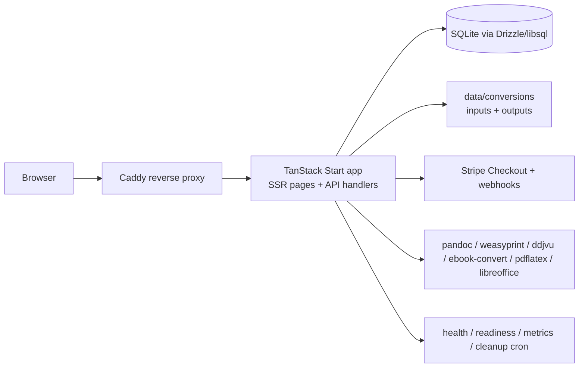
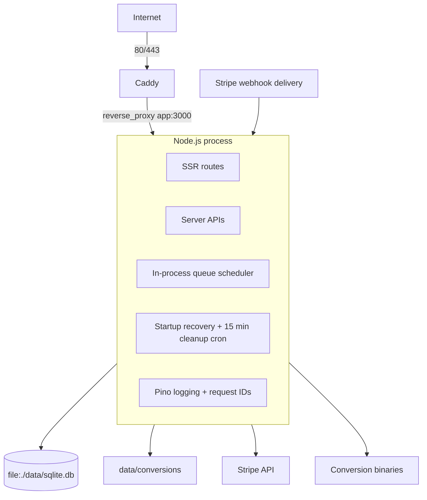
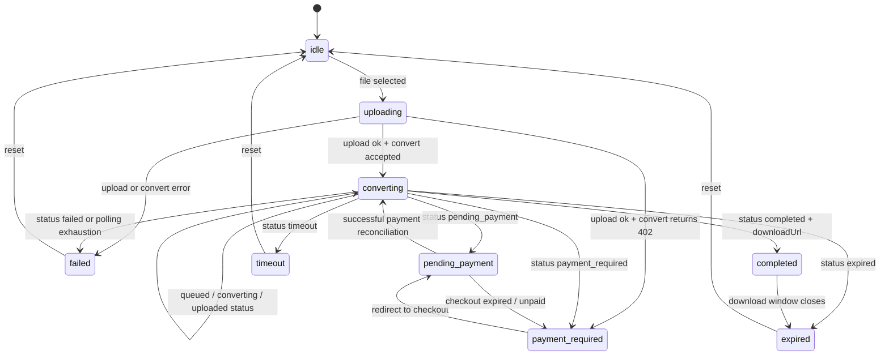
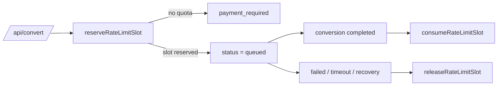
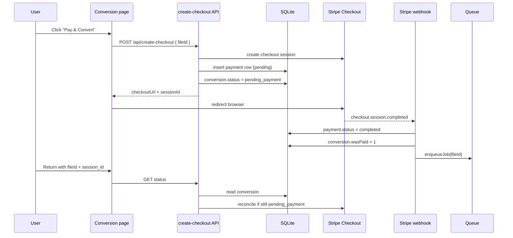
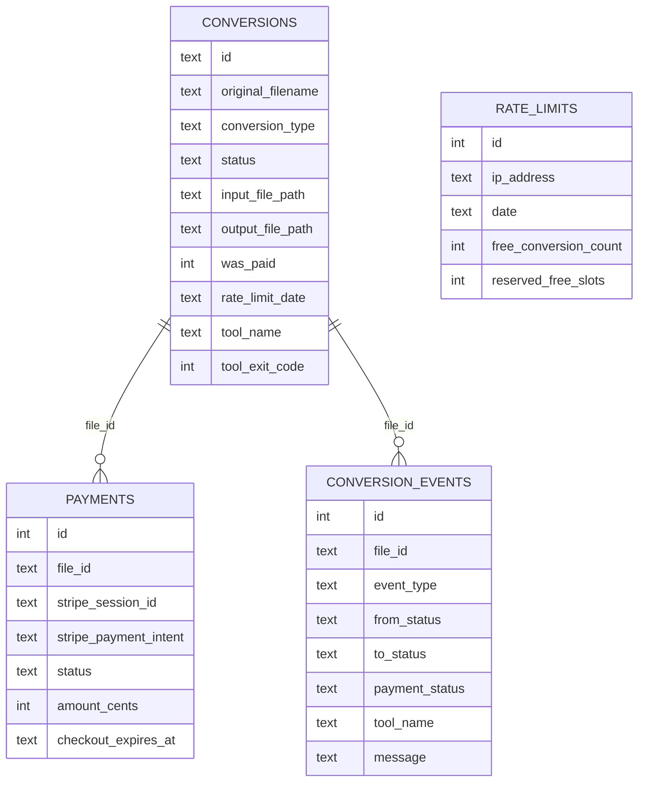
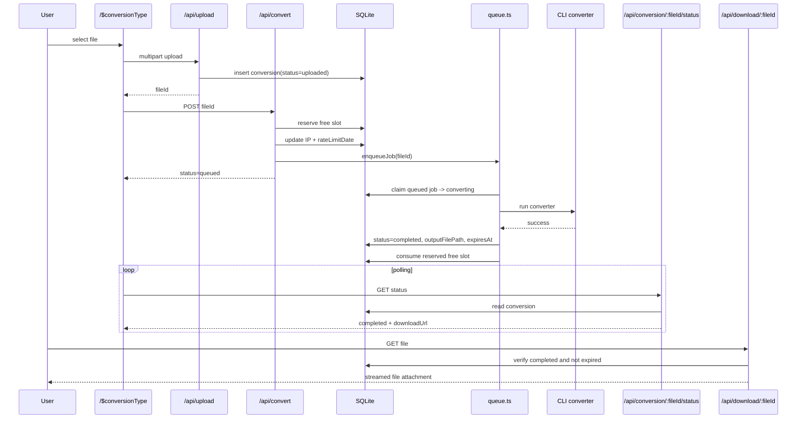
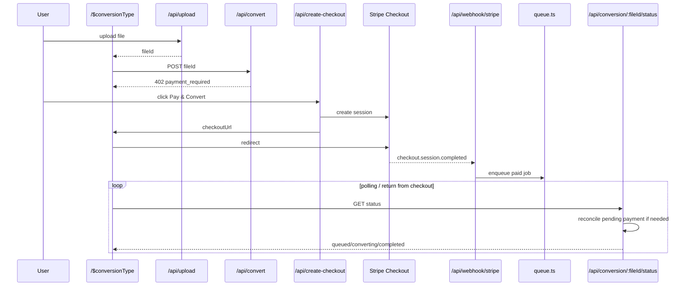

# WittyFlip Architecture

> This document describes the **current implemented architecture** of WittyFlip as represented by the code in `app\`, `drizzle\`, `tests\`, and the deployment files at the repository root. It explains how the system is structured, how requests move through it, how payment and conversion are coordinated, which patterns are used, and where the main architectural trade-offs live.

---

## 1. Executive Summary

WittyFlip is a low-infrastructure document conversion service built around a simple operating model:

- **SEO-driven landing pages** expose one route per conversion type.
- **A TanStack Start application** handles both SSR pages and server APIs.
- **SQLite** is the system of record for conversions, payments, quotas, and event history.
- **Local disk** stores uploaded inputs and converted outputs for a short retention window.
- **External command-line tools** perform the actual document conversions.
- **Stripe Checkout** handles paid conversions after the free daily quota is exhausted.
- **A single-process queue scheduler** controls concurrency and job execution.

The architecture is intentionally pragmatic:

- keep the operational footprint small,
- avoid user accounts,
- make uploads and conversions feel immediate,
- use explicit state transitions instead of hidden background magic,
- and keep the service debuggable with straightforward tables, files, and logs.

At a high level, the system behaves like this:



The key architectural idea is that **the `conversions.status` column is the backbone of the application**. Most of the system is organized around moving a conversion record through well-defined states: upload, rate-limit decision, queueing, processing, completion, failure, payment waiting, and expiry.

---

## 2. Architectural Goals and Constraints

The implementation reflects a specific product strategy from `spec\SPEC.md` and the codebase guidance in `CLAUDE.md`.

### Product-level goals

- Fast conversion for users arriving from search.
- No account system and no long-lived user session model.
- A freemium model: **2 free conversions per IP per UTC day**, then **$0.49 per file**.
- Support for niche conversion pairs rather than a generic "convert anything" engine.

### Technical constraints

- Minimal deployment complexity.
- Small VPS-friendly runtime.
- Deterministic file naming and cleanup.
- Stronger-than-extension-only file validation.
- Explicit, auditable payment and conversion state.
- Safe handling of untrusted uploads and untrusted tool stderr.

### Consequences of those constraints

- SQLite is preferred over a more operationally expensive database.
- The queue is implemented in the application process rather than a separate queue service.
- Conversion jobs are not distributed across workers today.
- The supported conversions are explicitly enumerated in code, not dynamically discovered.
- The system is optimized for simplicity and correctness before horizontal scale.

---

## 3. Top-Level Runtime Architecture

The runtime can be understood as five cooperating layers:

1. **Presentation layer**
   - SSR conversion pages and a home page.
   - Client-side React state for upload, payment, and status polling.

2. **Application/API layer**
   - TanStack Start server functions under `app\server\api\`.
   - File-route handlers under `app\routes\api\`.

3. **Domain/infrastructure layer**
   - Conversion catalog.
   - Queue scheduler.
   - Rate limiting.
   - Stripe orchestration.
   - File path helpers.
   - Cleanup and runtime bootstrap.

4. **Persistence layer**
   - SQLite tables: `conversions`, `payments`, `rate_limits`, `conversion_events`.
   - Trigger-based event history in migration `drizzle\0003_pretty_baron_zemo.sql`.

5. **Execution layer**
   - Child-process execution of Pandoc, WeasyPrint, DjVuLibre, Calibre, pdfLaTeX, and LibreOffice.

### Current deployed topology



### Deployment artifacts

- `Dockerfile` builds the application image and installs the conversion binaries.
- `docker-compose.yml` runs:
  - `app` on port `3000`,
  - `caddy` on ports `80` and `443`,
  - and mounts `.\data` into the app container.
- `Caddyfile` adds security headers, request-body size limits, and reverse proxying.

---

## 4. Repository Structure and Responsibilities

The codebase is organized so that the product model, runtime utilities, and transport layer remain relatively separate.

### High-value directories

| Path | Role |
| --- | --- |
| `app\routes\` | TanStack Start page routes and file-based API routes |
| `app\server\api\` | Server functions and transport-agnostic API processing logic |
| `app\lib\` | Domain logic, queue, Stripe, validation, file handling, observability |
| `app\lib\converters\` | Converter registry, shared helpers, and per-tool adapters |
| `app\lib\db\` | Drizzle schema and DB bootstrap |
| `drizzle\` | SQL migrations, including event triggers |
| `tests\unit\` | Focused behavioral tests for modules and state transitions |
| `tests\integration\` | End-to-end HTTP lifecycle tests |
| `tests\smoke\` | Real-tool smoke tests for installed conversion binaries |
| `spec\` | Product, deployment, and architecture documentation |
| `tools\alert-check\` | External monitor that polls readiness/metrics and emits alerts |

### Important top-level implementation files

| File | Why it matters |
| --- | --- |
| `app\lib\conversions.ts` | Canonical catalog of supported conversions and SEO metadata |
| `app\server\api\contracts.ts` | Shared API statuses, response shapes, and UUID validation |
| `app\server\api\upload.ts` | Upload validation, file persistence, initial conversion record creation |
| `app\server\api\convert.ts` | Quota check, slot reservation, queue entry point |
| `app\server\api\create-checkout.ts` | Checkout orchestration entry point |
| `app\server\api\conversion-status.ts` | Polling endpoint with pending-payment reconciliation |
| `app\lib\queue.ts` | In-process scheduler and job executor |
| `app\lib\stripe.ts` | Stripe lifecycle, idempotency, and reconciliation logic |
| `app\lib\rate-limit.ts` | Daily free quota model |
| `app\lib\request-rate-limit.ts` | Per-minute API throttling |
| `app\lib\request-ip.ts` | Trusted-proxy IP resolution |
| `app\lib\cleanup.ts` | Expiry cleanup, orphan scanning |
| `app\lib\server-runtime.ts` | One-time bootstrap for the server process |
| `app\lib\db\schema.ts` | Table definitions |
| `drizzle\0003_pretty_baron_zemo.sql` | Event table triggers for observability |

---

## 5. Core Architectural Patterns

Several patterns repeat throughout the implementation. Understanding them explains most of the system.

### 5.1 Catalog-driven product model

The file `app\lib\conversions.ts` is a **single source of truth** for each supported conversion type.

Each `ConversionType` object defines:

- the public route slug,
- source and target formats,
- accepted extensions and MIME types,
- the tool that should run the conversion,
- UI branding data,
- SEO metadata,
- long-form landing-page content,
- FAQ content,
- and related conversions.

This means one object powers:

- routing (`/$conversionType`),
- validation (`validateFile`),
- output naming,
- content rendering,
- download MIME type,
- and sitemap generation.

This is a strong example of a **data-driven feature definition** pattern.

### 5.2 State-machine-as-database-column

The `conversions.status` field is not just metadata. It is the application's primary workflow engine.

Instead of keeping job state in memory or a separate queue broker, the system uses a record with explicit states:

- `uploaded`
- `payment_required`
- `pending_payment`
- `queued`
- `converting`
- `completed`
- `failed`
- `timeout`
- `expired`

That gives the application:

- resumability,
- easier debugging,
- SQL-queryable operational state,
- simpler crash recovery,
- and a clean integration point for API polling.

### 5.3 Reservation pattern for free quota

The daily free quota is not consumed at upload time. It is consumed only when a conversion actually succeeds.

To make that safe under concurrency, WittyFlip uses a **reserve / consume / release** pattern:

1. reserve a slot when `/api/convert` is accepted,
2. consume it only after successful completion,
3. release it on failure, timeout, or startup recovery.

That avoids charging free quota for failed jobs.

### 5.4 Lazy server dependency boundary

The server API modules repeatedly use `createServerOnlyFn` plus cached dynamic imports.

That pattern does three things:

- keeps Node-only dependencies out of client bundles,
- delays module initialization until server execution,
- and centralizes dependency wiring in small "server deps" factories.

This is visible in files like:

- `app\server\api\upload.ts`
- `app\server\api\convert.ts`
- `app\server\api\create-checkout.ts`
- `app\server\api\conversion-status.ts`

### 5.5 Trigger-based event history

`conversion_events` is populated by **SQLite triggers**, not by ad hoc application inserts.

That is important because it means event history is attached to persistence itself:

- insert a conversion -> create a `conversion_created` event,
- change conversion status -> create a `conversion_status_changed` event,
- insert a payment -> create a `payment_created` event,
- change payment status -> create a `payment_status_changed` event.

This reduces the risk that app code forgets to emit a matching event.

### 5.6 Idempotent runtime bootstrap

`initializeServerRuntime()` in `app\lib\server-runtime.ts` is designed to be safe to call from many entry points. It validates environment, registers converters, starts cleanup, recovers stale jobs, and starts the cron schedule exactly once.

That is an **idempotent initialization** pattern.

---

## 6. Domain Model: Interfaces, Types, and Canonical Objects

This section describes the most important TypeScript objects and what role they play.

### 6.1 `ConversionType`

Defined in `app\lib\conversions.ts`.

This is the canonical product object.

| Field | Purpose |
| --- | --- |
| `slug` | Route segment and logical conversion identifier |
| `sourceFormat`, `targetFormat` | Human-readable source/target names |
| `sourceExtensions` | Allowed uploaded filename extensions |
| `sourceMimeTypes` | Expected source MIME types |
| `targetExtension`, `targetMimeType` | Download naming and response headers |
| `toolName` | Which converter adapter to use |
| `formatColor` | UI branding accent |
| `seo` | Meta title, description, H1, keywords |
| `seoContent` | SSR-rendered conversion-specific body content |
| `faq` | FAQ schema + visible FAQ content |
| `relatedConversions` | Cross-linking on pages |

### 6.2 `ConversionJobStatus`

Defined in `app\server\api\contracts.ts`.

This is the public and internal workflow vocabulary:

```ts
'uploaded'
|'payment_required'
|'pending_payment'
|'queued'
|'converting'
|'completed'
|'failed'
|'timeout'
|'expired'
```

The `statusToProgress()` helper maps these to progress percentages for UI rendering.

### 6.3 `Converter`

Defined in `app\lib\converters\index.ts`.

```ts
interface Converter {
  convert(inputPath: string, outputPath: string, signal: AbortSignal): Promise<ConvertResult>
}
```

This is the abstraction that lets the queue remain independent of the specific CLI binary.

### 6.4 `ConvertResult`

Also defined in `app\lib\converters\index.ts`.

```ts
interface ConvertResult {
  success: boolean
  outputPath: string
  exitCode: number
  errorMessage?: string
  durationMs: number
}
```

This object gives the queue exactly what it needs to persist outcome, timing, and messaging.

### 6.5 API response contracts

Defined in `app\server\api\contracts.ts`.

Key response shapes:

- `UploadResponse`
- `ConversionStatusResponse`
- `CheckoutResponse`
- `RateLimitStatusResponse`
- `ApiErrorResponse`

The important pattern here is that **all API errors share a stable shape**:

```ts
{
  error: string
  message: string
  fileId?: string
  status?: ConversionJobStatus
  checkoutUrl?: string
  remaining?: number
  limit?: number
  resetAt?: string
}
```

That consistency makes the UI and tests simpler.

### 6.6 `RateLimitResult` and `RateLimitReservation`

Defined in `app\lib\rate-limit.ts`.

These types model the outcome of quota checking and the special case where a free slot is reserved for later consumption.

---

## 7. Supported Conversion Matrix

Current supported conversion types from `app\lib\conversions.ts`:

| Slug | Source | Target | Tool |
| --- | --- | --- | --- |
| `docx-to-markdown` | DOCX | Markdown | `pandoc` |
| `markdown-to-pdf` | Markdown | PDF | `pandoc` with `--pdf-engine=weasyprint` |
| `html-to-pdf` | HTML | PDF | `weasyprint` |
| `djvu-to-pdf` | DjVu | PDF | `ddjvu` |
| `epub-to-mobi` | EPUB | MOBI | `ebook-convert` |
| `odt-to-docx` | ODT | DOCX | `pandoc` |
| `latex-to-pdf` | LaTeX | PDF | `pdflatex` |

### Important note about LibreOffice

The repository includes a `libreofficeConverter` and registers it in `app\lib\converters\register-all.ts`, but **no current `ConversionType` points to `toolName: 'libreoffice'`**. In practice, that means LibreOffice exists as an available adapter, but not as an active route selection today.

---

## 8. Routing and Page Architecture

### 8.1 Current page routes

| Route | Purpose |
| --- | --- |
| `/` | Home page listing supported conversions |
| `/$conversionType` | SSR landing page and interactive conversion UI |

### 8.2 Current API routes

| Route | Implementation style | Purpose |
| --- | --- | --- |
| `POST /api/upload` | server API | upload and validation |
| `POST /api/convert` | server API | quota decision + queueing |
| `GET /api/conversion/:fileId/status` | server API | polling and payment reconciliation |
| `GET /api/rate-limit-status` | server API | quota display |
| `POST /api/create-checkout` | server API | Stripe checkout session creation |
| `GET /api/download/:fileId` | file route | binary file streaming |
| `POST /api/webhook/stripe` | file route | Stripe webhook intake |
| `GET /api/health` | file route | liveness |
| `GET /api/health/ready` | file route | readiness |
| `GET /api/metrics` | file route | protected operational metrics |
| `GET /api/sitemap.xml` | file route | sitemap generation |

### 8.3 Why both server APIs and file routes exist

The codebase uses two transport styles:

- **server functions** under `app\server\api\` when the same logic should be callable by the React app through TanStack Start's server-function mechanism,
- **file routes** under `app\routes\api\` when raw HTTP handling is a better fit, especially for:
  - streaming downloads,
  - webhook signature verification on raw bodies,
  - readiness and metrics probes,
  - sitemap XML.

### 8.4 Route-driven landing pages

`app\routes\$conversionType.tsx` is the main product page.

It does all of the following:

- validates search params via Zod,
- loads the `ConversionType` definition for the slug,
- fetches initial quota state,
- injects SEO meta tags,
- injects structured data (`FAQPage` and `SoftwareApplication`),
- renders the interactive conversion UI,
- renders conversion-specific SEO content and FAQs.

This makes each conversion page both:

- an SEO landing page,
- and the product's primary application surface.

### 8.5 SEO surface

The SEO architecture is intentionally baked into routing:

- conversion-specific page metadata comes from `ConversionType.seo`,
- FAQ schema comes from `app\lib\structured-data.ts`,
- sitemap XML comes from `app\routes\api\sitemap[.]xml.tsx`,
- `public\robots.txt` allows indexing for pages and disallows `/api/`.

### 8.6 What is not wired yet

The repository contains `content\blog\`, but there is currently **no blog route** in `app\routes\`. So the blog/content side exists only as a placeholder today.

---

## 9. Frontend Architecture and UI State

The client side is deliberately small. Most business logic remains on the server.

### 9.1 Composition of the conversion page

The route `app\routes\$conversionType.tsx` composes the page from focused components:

- `ConversionHero`
- `QuotaBadge`
- `FileUploader`
- `ConversionProgress`
- `PaymentPrompt`
- `ConversionStatus`
- `ErrorCard`
- `SEOContent`
- `FAQSection`
- `RelatedConversions`

This keeps the page itself orchestration-heavy but visually modular.

### 9.2 Client state machine

The hook `app\hooks\useConversionFlow.ts` drives the user-visible workflow.

Its states are:

- `idle`
- `uploading`
- `converting`
- `completed`
- `payment_required`
- `pending_payment`
- `failed`
- `timeout`
- `expired`

Those are not a one-to-one copy of server statuses, but they are intentionally close so the UI can remain easy to reason about.



### 9.3 Search param persistence

`app\lib\conversion-route-state.ts` maps route search params into initial UI state:

- `fileId` lets the page recover a conversion after refresh,
- `session_id` signals return from Stripe Checkout,
- `canceled=true` signals a canceled checkout.

This means the route itself carries enough information to reconstruct the user's current conversion journey.

### 9.4 Polling design

Status polling uses `useConversionFlow` plus `app\lib\status-polling.ts`.

Important behaviors:

- only poll while in an active state (`converting`, `pending_payment`),
- stop polling when the page is not visible,
- back off on repeated poll failures,
- respect server rate limiting by computing a safe poll interval with headroom.

That is a nice example of a **visibility-aware, rate-limit-aware polling strategy**.

---

## 10. Upload Pipeline

The upload flow is implemented in `app\server\api\upload.ts`.

### Upload steps

1. **Server runtime initialization**
   - `initializeServerRuntime()` is called to guarantee converter registration and housekeeping startup.

2. **Per-minute request throttling**
   - `checkAndConsumeRequestRateLimit(clientIp)` guards the endpoint.

3. **Transport validation**
   - request data must be `FormData`,
   - `file` must exist and be a `File`,
   - `conversionType` must be present.

4. **Catalog validation**
   - `getConversionBySlug(conversionType)` ensures the route actually exists.

5. **File validation**
   - file size must be <= 10 MB,
   - `validateFile()` checks the binary or textual structure.

6. **Storage naming**
   - the file gets a new UUID,
   - the stored filename becomes `{uuid}.{ext}`,
   - the file is written to `data\conversions`.

7. **Metadata persistence**
   - a `conversions` row is inserted with status `uploaded`.

### Why upload is separate from conversion

This is an intentional product and architecture decision:

- upload is cheap and immediate,
- payment/quota logic happens later,
- users get a `fileId` immediately,
- and failed or unpaid conversions remain first-class records.

That separation is what makes the later state machine possible.

---

## 11. File Validation Model

File validation lives in `app\lib\file-validation.ts`.

This module is a good example of **format-aware validation instead of trusting file extensions**.

### Rules by file class

#### Text formats

For `.md`, `.markdown`, `.tex`, `.html`, and `.htm`:

- no magic bytes are expected,
- the file must decode as valid UTF-8.

#### DjVu

For `.djvu`:

- the validator checks the `AT&T FORM` header,
- and confirms `DJVU` or `DJVM` in the expected chunk position.

#### ZIP-based document formats

For `.docx`, `.odt`, and `.epub`:

- `file-type` is used to detect the actual MIME class,
- the file may legitimately appear as `application/zip`,
- so the validator opens the ZIP structure and checks expected entries.

Examples:

- DOCX must include `[Content_Types].xml` and `word/`,
- ODT must include a stored `mimetype` entry with the ODT MIME string,
- EPUB must include a stored `mimetype` entry with `application/epub+zip`.

### Why this matters

This design prevents several classes of bad input:

- renamed files with misleading extensions,
- corrupted ZIP containers,
- invalid text payloads,
- and malformed DjVu uploads.

---

## 12. IP Resolution and Rate Limiting

WittyFlip has **two distinct rate-limiting layers**.

### 12.1 Request throttling

Implemented in `app\lib\request-rate-limit.ts`.

This is an in-memory, per-process bucket system:

- default limit: **10 requests per minute per IP**,
- status polling limit: **20 requests per minute per IP**,
- separate bucket keys are used for some endpoints (`status`, `quota`).

This protects the HTTP surface from hammering or accidental loops.

### 12.2 Free conversion quota

Implemented in `app\lib\rate-limit.ts`.

This is persistent and daily:

- limit: **2 free conversions per IP per UTC day**,
- stored in the `rate_limits` table,
- backed by explicit `freeConversionCount` and `reservedFreeSlots` columns.

### 12.3 Trusted proxy IP resolution

Implemented in `app\lib\request-ip.ts`.

The system does **not blindly trust `X-Forwarded-For`**.

Instead:

1. normalize the peer IP,
2. verify the peer matches a trusted proxy CIDR,
3. only then use the leftmost forwarded client IP,
4. otherwise fall back to the direct peer.

That means spoofed forwarded headers from direct clients are ignored.

### 12.4 The reserve / consume / release pattern

This is one of the most important mechanics in the system.



Semantically:

- **reserve** = hold a free slot while work is pending,
- **consume** = permanently count a successful free conversion,
- **release** = undo the reservation when no successful free conversion happened.

This is cleaner than simply incrementing a counter at request start.

---

## 13. Conversion Start and Queue Entry

The endpoint `app\server\api\convert.ts` decides whether a file can move forward.

### Behavior by current conversion status

If a conversion is already:

- `payment_required` -> return a 402 error shape immediately,
- `queued`, `converting`, `completed`, `expired`, `pending_payment`, `failed`, or `timeout` -> return the current status payload,
- `uploaded` -> attempt quota reservation and queue it.

This makes `/api/convert` reasonably idempotent from a client perspective.

### Queue entry steps

For `uploaded` conversions:

1. reserve a rate-limit slot,
2. if no slot is available, mark the record `payment_required`,
3. update the record's `ipAddress` and `rateLimitDate`,
4. call `enqueueJob(fileId)`,
5. return a queued status payload.

The endpoint does not itself run the conversion. It only moves the record into the queueing part of the lifecycle.

---

## 14. Payment Architecture

Payment orchestration is split between:

- `app\server\api\create-checkout.ts`,
- `app\lib\stripe.ts`,
- `app\routes\api\webhook\stripe.tsx`,
- and reconciliation logic triggered by status polling.

### 14.1 Why payment is a separate state path

The design intentionally treats payment as a transition path out of `payment_required`, not as an overlay on the queue.

That gives clean semantics:

- the conversion exists before payment,
- payment is associated with a concrete `fileId`,
- the user can leave and come back,
- and the queue does not care whether the job was free or paid except for quota consumption.

### 14.2 Checkout creation

`createCheckoutSession(fileId)` does the following:

1. fetch the conversion,
2. require status `payment_required` or `pending_payment`,
3. look for a reusable open pending session,
4. if none exists, create a new Stripe Checkout session,
5. insert a `payments` row,
6. set the conversion status to `pending_payment`.

### 14.3 Reusable-session pattern

An important implementation detail is that checkout creation is not blindly "new session every time".

The code first checks for:

- pending payment rows for the same `fileId`,
- non-expired checkout windows,
- and live Stripe sessions that are still `open`.

If one exists, it is reused.

That prevents checkout spam and makes retries more stable.

### 14.4 Webhook completion handling

The file route `app\routes\api\webhook\stripe.tsx`:

1. reads the raw body,
2. validates the `stripe-signature`,
3. processes `checkout.session.completed`,
4. delegates to `handleCheckoutCompleted()`.

`handleCheckoutCompleted()` then:

- extracts `fileId` from session metadata,
- verifies the payment row exists and matches,
- verifies the conversion row exists,
- validates amount and currency,
- marks the payment completed,
- stores the payment intent,
- marks the conversion `wasPaid = 1`,
- and, if the conversion is still `pending_payment`, enqueues it.

### 14.5 Pending-payment reconciliation

This is one of the most thoughtful parts of the architecture.

When a client polls `/api/conversion/:fileId/status` and the conversion is still `pending_payment`, the server calls `reconcilePendingPayment(fileId)`.

That function checks whether:

- the checkout actually succeeded before the webhook was processed,
- the session expired,
- the session completed without paid status,
- or the session is still open.

This solves a common "redirect beat webhook" race condition.

### 14.6 Payment sequence



### 14.7 Payment idempotency model

The payment layer is deliberately defensive:

- duplicate webhooks are tolerated,
- completed payments are not re-applied destructively,
- recovery re-enqueue happens only when payment is complete but conversion is still `pending_payment`,
- unrecoverable missing-payment or missing-conversion states are acknowledged to avoid retry storms.

This is exactly the kind of logic Stripe integrations often need, and the code handles it explicitly.

---

## 15. Queue and Job Execution Architecture

The queue lives in `app\lib\queue.ts`.

This is a **database-backed queue with an in-memory scheduler**.

### 15.1 What the queue really is

There is no separate queue table and no message broker.

Instead:

- queued jobs are rows in `conversions` with `status = 'queued'`,
- active jobs are rows with `status = 'converting'`,
- completed jobs are rows with terminal statuses.

### 15.2 Scheduler control flags

The module uses two process-local flags:

- `isProcessing`
- `shouldProcessAgain`

This is a re-entrancy guard:

- if multiple events try to start queue processing at once,
- only one loop runs,
- and any concurrent attempt simply requests another pass afterward.

### 15.3 Concurrency cap

`MAX_CONCURRENT_JOBS = 5`

The scheduler repeatedly:

1. counts active `converting` jobs,
2. stops starting new jobs when the cap is reached,
3. picks the oldest `queued` job by `createdAt`,
4. atomically claims it by setting status to `converting`,
5. launches `runConversion(job)` without blocking the scheduler.

### 15.4 Queue claim pattern

Claiming is done with a conditional update:

- select oldest queued row,
- update it only if it is still `queued`,
- continue if another actor claimed it first.

This is a standard **compare-and-set claim** pattern implemented with SQL rows.

### 15.5 Conversion timeout

The current implementation uses:

- `CONVERSION_TIMEOUT_MS = 5 * 60_000`

The queue wraps each job with an `AbortController`.

If the timeout fires:

- the conversion becomes `timeout`,
- the partial output is deleted,
- and any reserved free slot is released.

### 15.6 Job result handling

On success:

- output existence is checked,
- output size is recorded,
- output path is persisted,
- expiry is set to one hour ahead,
- tool name, exit code, and duration are stored,
- reserved free slot is consumed if the job was unpaid.

On converter-declared failure:

- partial output is deleted,
- status becomes `failed`,
- sanitized error message is stored,
- reserved free slot is released.

On thrown error:

- `AbortError` becomes `timeout`,
- other errors become `failed`,
- messages are sanitized before persistence.

### 15.7 Queue flow

```mermaid
flowchart TD
    Enqueue[enqueueJob(fileId)] --> SetQueued[set status = queued when allowed]
    SetQueued --> Process[processQueue]
    Process --> Capacity{active jobs < 5?}
    Capacity -->|no| Exit[stop pass]
    Capacity -->|yes| Next[select oldest queued job]
    Next --> Claim{atomic claim succeeds?}
    Claim -->|no| Next
    Claim -->|yes| Run[runConversion(job)]

    Run --> Success{conversion succeeded and output exists?}
    Success -->|yes| Complete[status = completed + expiresAt]
    Success -->|no| Fail[status = failed]
    Run --> Timeout[status = timeout on AbortError]

    Complete --> Continue[trigger another processQueue pass]
    Fail --> Continue
    Timeout --> Continue
```

---

## 16. Converter Subsystem

The converter layer is intentionally thin. Each adapter is responsible for translating a logical conversion request into a CLI invocation.

### 16.1 Registry

Defined in `app\lib\converters\index.ts`.

- `registerConverter(toolName, converter)`
- `getConverter(toolName)`

The queue never imports a specific converter directly. It asks the registry for the tool named by the `ConversionType`.

### 16.2 Registration

`app\lib\converters\register-all.ts` registers:

- `pandoc`
- `djvulibre`
- `calibre`
- `weasyprint`
- `pdflatex`
- `libreoffice`

Registration is idempotent through a `registered` guard.

### 16.3 Shared helpers

#### `spawnWithSignal`

Defined in `app\lib\converters\spawn-helper.ts`.

Responsibilities:

- spawn the child process,
- attach an `AbortSignal`,
- collect stdout/stderr,
- normalize missing-tool errors (`ENOENT`) into readable messages.

#### `runSimpleConversion`

Defined in `app\lib\converters\converter-run.ts`.

Responsibilities:

- run command + args,
- measure duration,
- treat non-zero exit as failure,
- sanitize stderr,
- return a standard `ConvertResult`.

#### `sanitizeToolError`

Defined in `app\lib\converters\sanitize-error.ts`.

Responsibilities:

- remove ANSI codes,
- strip absolute filesystem paths,
- bound message length,
- avoid leaking server path details back to users.

### 16.4 Per-tool adapter behavior

| Adapter | File | Behavior |
| --- | --- | --- |
| Pandoc | `app\lib\converters\pandoc.ts` | Adds `-t markdown` for DOCX -> Markdown and `--pdf-engine=weasyprint` for Markdown -> PDF |
| WeasyPrint | `app\lib\converters\weasyprint.ts` | Uses `--presentational-hints --base-url /dev/null` |
| DjVuLibre | `app\lib\converters\djvulibre.ts` | Runs `ddjvu -format=pdf` |
| Calibre | `app\lib\converters\calibre.ts` | Runs `ebook-convert` directly |
| pdfLaTeX | `app\lib\converters\pdflatex.ts` | Uses temp output dir, extracts `!` error lines, renames generated PDF |
| LibreOffice | `app\lib\converters\libreoffice.ts` | Uses per-invocation temp profile and headless conversion |

### 16.5 Security and containment notes

The converter layer has several defensive decisions:

- user filenames are never used for storage paths,
- tool errors are sanitized before persistence,
- pdfLaTeX and LibreOffice use temporary working/profile directories,
- WeasyPrint includes an explicit warning that `--base-url /dev/null` is **not** enough by itself for SSRF protection.

That last point is important:

> The current code expects **runtime network isolation** to provide true HTML-to-PDF SSRF hardening.

So the security story for HTML conversion is partly in code and partly in deployment/runtime policy.

---

## 17. Persistence Model

The database is defined in `app\lib\db\schema.ts` and instantiated in `app\lib\db\index.ts` with Drizzle over libsql.



### 17.1 `conversions`

This is the main aggregate table.

Important fields:

| Field | Meaning |
| --- | --- |
| `id` | Public `fileId` UUID |
| `originalFilename` | Original uploaded filename for user-friendly download naming |
| `sourceFormat`, `targetFormat` | Format metadata |
| `conversionType` | Slug that links back to the conversion catalog |
| `ipAddress` | Current resolved client IP |
| `inputFilePath` | Stored input filename |
| `outputFilePath` | Stored output path if conversion completed |
| `rateLimitDate` | Which UTC quota bucket the free reservation belongs to |
| `toolName`, `toolExitCode`, `conversionTimeMs` | Operational telemetry |
| `wasPaid` | Whether this conversion bypassed free quota |
| `status` | Workflow state |
| `errorMessage` | User-safe failure reason |
| `conversionStartedAt`, `conversionCompletedAt` | Runtime timestamps |
| `expiresAt` | Download expiry timestamp |

### 17.2 `payments`

This is the payment trail for a conversion.

Important fields:

| Field | Meaning |
| --- | --- |
| `fileId` | Logical link to `conversions.id` |
| `stripeSessionId` | Unique Stripe checkout session identifier |
| `stripePaymentIntent` | Payment intent captured from completion |
| `amountCents`, `currency` | Price contract |
| `conversionType` | Redundant audit context |
| `ipAddress` | Client IP at checkout time |
| `status` | `pending`, `completed`, `expired`, or `failed` |
| `checkoutExpiresAt` | Stripe session expiry |
| `completedAt` | Payment confirmation timestamp |

### 17.3 `rate_limits`

This is not a generic rate-limit table. It specifically models the free conversion quota.

Important fields:

| Field | Meaning |
| --- | --- |
| `ipAddress` | User bucket |
| `date` | UTC day bucket |
| `freeConversionCount` | Successfully completed free conversions |
| `reservedFreeSlots` | Accepted but not yet finalized free conversions |

### 17.4 `conversion_events`

This table provides durable operational history.

Important fields:

| Field | Meaning |
| --- | --- |
| `fileId` | Conversion-level correlation key |
| `eventType` | `conversion_created`, `conversion_status_changed`, `payment_created`, `payment_status_changed` |
| `fromStatus`, `toStatus` | Conversion state transitions |
| `paymentStatus` | Payment state where relevant |
| `toolName` | Tool context |
| `message` | Human-readable event text |
| `createdAt` | Event time |

### 17.5 Trigger-based population

The event table is populated by SQL triggers in `drizzle\0003_pretty_baron_zemo.sql`, not by explicit event-writing application code.

That is a key part of the operational design.

---

## 18. End-to-End Conversion Lifecycle

The best way to understand WittyFlip is to follow a conversion from start to finish.

### 18.1 Free conversion path



### 18.2 Paid conversion path



### 18.3 State transition table

| From | To | Why |
| --- | --- | --- |
| `uploaded` | `queued` | free slot reserved and job enqueued |
| `uploaded` | `payment_required` | no free quota available |
| `payment_required` | `pending_payment` | checkout created or reused |
| `pending_payment` | `queued` | payment completed and job enqueued |
| `queued` | `converting` | queue claimed the job |
| `converting` | `completed` | tool succeeded and produced output |
| `converting` | `failed` | tool failed or output missing |
| `converting` | `timeout` | AbortSignal fired |
| `completed` | `expired` | download window elapsed |
| `pending_payment` | `payment_required` | reconciliation detected expired or unpaid checkout |

---

## 19. Download and File Lifecycle

File lifecycle is split across:

- `app\lib\conversion-files.ts`
- `app\routes\api\download\$fileId.tsx`
- `app\lib\cleanup.ts`

### 19.1 Naming strategy

Inputs:

- `{fileId}.{sourceExtension}`

Outputs:

- `{fileId}-output{targetExtension}`

This makes paths deterministic, stable, and independent of user-provided names.

### 19.2 Why the original filename is still stored

The system stores `originalFilename` for user-facing download naming only.

At download time:

- the response filename is sanitized,
- illegal characters are removed,
- and both ASCII fallback and UTF-8 encoded forms are provided in `Content-Disposition`.

### 19.3 Expiry model

Completed conversions receive:

- `expiresAt = now + 1 hour`

That affects both:

- the status API,
- and the download route.

### 19.4 Cleanup model

`cleanupExpiredFiles()` does four main sweeps:

1. delete expired completed outputs and inputs, mark rows `expired`,
2. re-scan already-expired rows to remove leftovers,
3. delete inputs for failed/timeout conversions older than one hour,
4. expire stale `pending_payment` conversions older than two hours.

### 19.5 Orphan scanning

`scanOrphanFiles()` logs files in the conversions directory whose UUID prefix does not map to a DB row.

This is a simple but useful housekeeping diagnostic.

### 19.6 Artifact-missing recovery

If the status endpoint or download route finds a completed conversion whose output file no longer exists:

- the conversion is downgraded to `failed`,
- and the user is told to convert again.

That is better than silently returning a broken download.

---

## 20. Server Runtime Bootstrap and Housekeeping

`app\lib\server-runtime.ts` is the operational bootstrap point.

### On first server use, it performs:

1. environment validation,
2. converter registration,
3. stale job recovery,
4. immediate cleanup run,
5. orphan file scan,
6. startup of a `*/15 * * * *` cleanup cron,
7. SIGTERM shutdown registration.

### 20.1 Stale job recovery

If the process restarts while jobs are:

- `queued`
- or `converting`

those jobs are marked:

- `failed`
- with error `"Server restarted during conversion."`

Additionally:

- any reserved free slot is released,
- any output artifact already created is deleted.

This is the system's crash-recovery story.

### 20.2 Why bootstrap is called from request handlers

Instead of relying on a separate application-start entry point, multiple server handlers call `initializeServerRuntime()`.

That is practical for SSR/server-function environments because:

- the runtime is lazily created,
- handler code remains self-sufficient,
- and the bootstrap is safe because of its idempotent guard.

---

## 21. Observability and Operations

WittyFlip includes a modest but well-structured observability layer.

### 21.1 Logging

`app\lib\logger.ts` configures Pino:

- pretty logs in local development,
- JSON-style logs in production,
- silent mode during tests.

`app\lib\server-observability.ts` creates request-scoped child loggers with:

- route,
- request ID,
- optional bindings like `clientIp`.

### 21.2 Request IDs

`app\lib\observability.ts` provides:

- request ID extraction from `x-request-id`,
- generation fallback via `crypto.randomUUID()`,
- response header injection.

This makes request correlation possible across logs and API responses.

### 21.3 Health endpoints

#### `/api/health`

Purpose:

- simple liveness.

Response:

- `{ status: "ok" }`

#### `/api/health/ready`

Purpose:

- readiness and degraded-mode reporting.

Checks:

- database reachability and latency,
- conversions directory writability,
- response cache suppression (`Cache-Control: no-store`).

If readiness fails, the endpoint returns `503` and structured error codes instead of leaking raw internals.

### 21.4 Metrics endpoint

`/api/metrics` is protected by `METRICS_API_KEY` via Bearer auth.

It reports:

- disk usage and file count,
- queue depth and stalled-job counts,
- converter registration coverage,
- conversion success/failure/timeout stats,
- duration percentiles,
- event counts from `conversion_events`,
- request-rate-limit bucket counts,
- uptime and timestamp.

### 21.5 External alerting utility

`tools\alert-check\Program.cs` is a .NET utility that polls:

- `/api/health/ready`
- `/api/metrics`

and can send SMTP alerts for conditions like:

- app down,
- high disk usage,
- queue backlog,
- stalled jobs,
- low success rate,
- missing artifacts,
- no recent successful conversions.

This is not part of the request path, but it is part of the operational architecture.

---

## 22. Security Model

Security is handled as a collection of small, explicit boundaries.

### 22.1 Upload safety

- strict max size: 10 MB,
- extension + structure validation,
- no user-controlled storage paths,
- only known conversion types accepted.

### 22.2 Proxy trust boundary

- forwarded headers are trusted only when the direct peer is a configured trusted proxy,
- malformed forwarded values are ignored.

### 22.3 Payment safety

- Stripe webhook signatures are verified,
- session amount and currency are re-validated before completion is accepted,
- duplicate webhook delivery is handled explicitly.

### 22.4 Error-message hygiene

Tool stderr is sanitized before persistence and before surfacing to users:

- no ANSI junk,
- no leaked absolute filesystem paths,
- bounded message size.

### 22.5 Download safety

- only UUID-shaped `fileId` values are accepted,
- only completed and non-expired outputs are served,
- download filenames are sanitized before entering headers.

### 22.6 Browser-facing proxy headers

The `Caddyfile` sets:

- HSTS,
- `X-Frame-Options: DENY`,
- `X-Content-Type-Options: nosniff`,
- `Referrer-Policy`,
- a CSP limiting script/connect/frame origins.

### 22.7 Important caveat: HTML-to-PDF network isolation

The code explicitly documents that WeasyPrint's `--base-url /dev/null` is **not sufficient SSRF protection by itself**.

Therefore the security model assumes runtime isolation of outbound network access for HTML-to-PDF execution.

That is a real architectural caveat, not a documentation footnote.

---

## 23. Deployment Architecture

### 23.1 App container

The application container hosts:

- the built TanStack Start app,
- the SQLite file,
- the conversions directory,
- and the CLI conversion tools.

### 23.2 Reverse proxy

Caddy is responsible for:

- TLS termination,
- security headers,
- request body size limits,
- and proxying to the Node app.

### 23.3 Persistent storage

`docker-compose.yml` mounts `.\data` into the app container so that:

- `sqlite.db`
- and `data\conversions`

persist across restarts.

### 23.4 Environment variables

From `app\lib\env.ts`, the main runtime variables are:

| Variable | Role |
| --- | --- |
| `DATABASE_URL` | SQLite file URL, defaults to `file:./data/sqlite.db` |
| `BASE_URL` | public base URL, used for Stripe redirects and sitemap |
| `STRIPE_SECRET_KEY` | Stripe API access |
| `STRIPE_WEBHOOK_SECRET` | webhook signature verification |
| `METRICS_API_KEY` | auth for `/api/metrics` |
| `TRUSTED_PROXY_CIDRS` | which proxy peers may supply forwarded client IPs |

In production, missing Stripe secrets are fatal. Missing metrics auth is downgraded to a warning.

---

## 24. Testing Architecture

The test suite is substantial and intentionally mirrors the system architecture.

### 24.1 Unit tests

The `tests\unit\` directory covers:

- conversion catalog behavior,
- route-state derivation,
- request IP resolution,
- request throttling,
- quota reservation logic,
- queue execution and concurrency,
- Stripe checkout/webhook/reconciliation,
- cleanup behavior,
- crash recovery,
- metrics and readiness endpoints,
- conversion event triggers,
- converter adapters,
- error sanitization.

### 24.2 Integration tests

`tests\integration\api.test.ts` exercises realistic request flows:

- upload -> convert -> poll -> download,
- quota exhaustion -> payment_required,
- trusted proxy behavior,
- expired downloads,
- artifact-missing downgrades,
- request throttling,
- health endpoint checks.

### 24.3 Smoke tests

`tests\smoke\tooling-smoke.test.ts` can run real-tool smoke tests when `RUN_TOOLING_TESTS=1`.

That validates:

- installed conversion binaries,
- basic conversion adapter behavior,
- format validation on realistic sample files.

### 24.4 Test harness design

The test harness is interesting architecturally:

- `tests\helpers\test-env.ts` creates per-test temp sandboxes,
- sets `DATABASE_URL`,
- changes the process working directory,
- and creates the schema and event triggers directly in SQLite.

`tests\helpers\create-test-app.ts` then composes a raw Node HTTP server around the actual request handlers so tests exercise real transport logic without needing a browser.

This is a good example of a **thin integration harness around real modules** instead of a separate mock app.

---

## 25. Architectural Trade-offs and Current Boundaries

No architecture is neutral. These are the main trade-offs in the current design.

### 25.1 Strengths

- Very small operational footprint.
- Easy to debug with SQLite rows and local files.
- Clear state transitions.
- Strong test coverage around failure paths.
- Good separation between catalog, queue, payment, and transport layers.
- Reasonable observability for a lightweight service.

### 25.2 Limitations

- Queue execution is process-local, so horizontal scaling is not yet a solved problem.
- Request throttling is in-memory, so it is per-process rather than globally coordinated.
- HTML-to-PDF hardening depends partly on runtime environment, not code alone.
- `content\blog\` exists but the blog feature is not currently routed.
- LibreOffice is available as an adapter but not selected by any current conversion definition.

### 25.3 Why those trade-offs make sense here

For this product stage, they reduce complexity dramatically:

- a single small VPS is enough,
- SQLite is acceptable,
- a local queue is adequate,
- and the team keeps tight control over supported formats and failure behavior.

In other words, this is an architecture optimized for **clarity, low ops burden, and predictable behavior** more than for elastic multi-node scale.

---

## 26. Mental Model: How Everything Fits Together

If you want one compact mental model for the whole system, it is this:

1. **A conversion definition** in `app\lib\conversions.ts` defines the public product surface.
2. **A landing page** at `/$conversionType` renders the UI and starts the journey.
3. **Upload** creates a durable `conversions` row and stores the input file.
4. **Convert** decides whether the job is free or paid.
5. **Stripe** resolves the paid branch when needed.
6. **The queue** turns a queued conversion row into a completed or failed one.
7. **Polling** reads that row back into the UI.
8. **Download** streams the generated artifact until expiry.
9. **Cleanup and triggers** keep storage and operational history tidy.

Everything else in the system exists to make those nine steps safe, explicit, and observable.

---

## 27. Appendix: File Map for Future Readers

If you want to explore the implementation in code, start here:

- Product catalog: `app\lib\conversions.ts`
- Home page: `app\routes\index.tsx`
- Conversion page: `app\routes\$conversionType.tsx`
- Client flow hook: `app\hooks\useConversionFlow.ts`
- API contracts: `app\server\api\contracts.ts`
- Upload: `app\server\api\upload.ts`
- Convert: `app\server\api\convert.ts`
- Status: `app\server\api\conversion-status.ts`
- Checkout: `app\server\api\create-checkout.ts`
- Download: `app\routes\api\download\$fileId.tsx`
- Webhook: `app\routes\api\webhook\stripe.tsx`
- Queue: `app\lib\queue.ts`
- Stripe orchestration: `app\lib\stripe.ts`
- Quota logic: `app\lib\rate-limit.ts`
- Request throttling: `app\lib\request-rate-limit.ts`
- IP resolution: `app\lib\request-ip.ts`
- File validation: `app\lib\file-validation.ts`
- File storage helpers: `app\lib\conversion-files.ts`
- Runtime bootstrap: `app\lib\server-runtime.ts`
- Cleanup: `app\lib\cleanup.ts`
- DB schema: `app\lib\db\schema.ts`
- Event triggers: `drizzle\0003_pretty_baron_zemo.sql`
- Metrics: `app\routes\api\metrics.tsx`
- Readiness: `app\routes\api\health\ready.tsx`
- Tests: `tests\unit\`, `tests\integration\`, `tests\smoke\`

---

## 28. Final Assessment

WittyFlip is architected as a **catalog-driven SSR application with a database-backed workflow core**.

The system is not large, but it is structured around strong ideas:

- explicit state transitions,
- careful separation of upload, payment, queueing, and download,
- pragmatic persistence,
- trigger-backed event history,
- and test coverage that focuses on edge cases instead of only happy paths.

That makes it a good example of a small service whose architecture is simple on purpose, but not simplistic.
